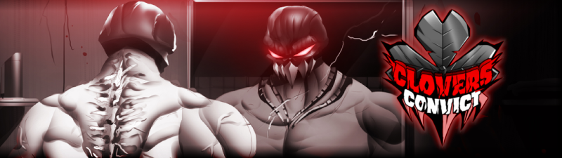
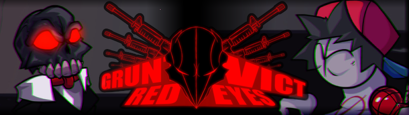

## About me
- 17 years old.
- Programmer, Musician, and Artist

## Projects

A Friday Night Funkin' Mod Directed by [Wellwoven](https://x.com/selloutstreame1) about Convict; the main antagonist of [Pico vs. Convict](https://pico.wiki.gg/wiki/Pico_vs._Convict).

A Friday Night Funkin' Mod Directed by [Graphic](https://x.com/graphicthereal) about Convict but in the style of the Newgrounds series [Madness Combat](https://www.newgrounds.com/portal/view/58182). Sadly the project was cancelled before a full release. Its source code can be found [here.]([https://github.com/GuitarML/PedalNetRT](https://github.com/heavybruh/GRUNTVICT))
  
## Current languages I'm learning

